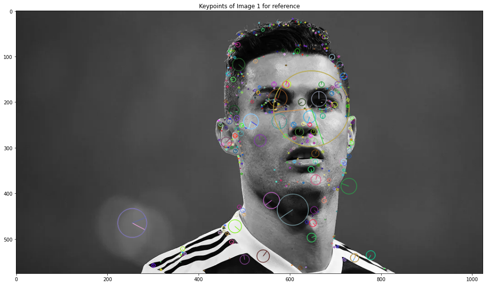
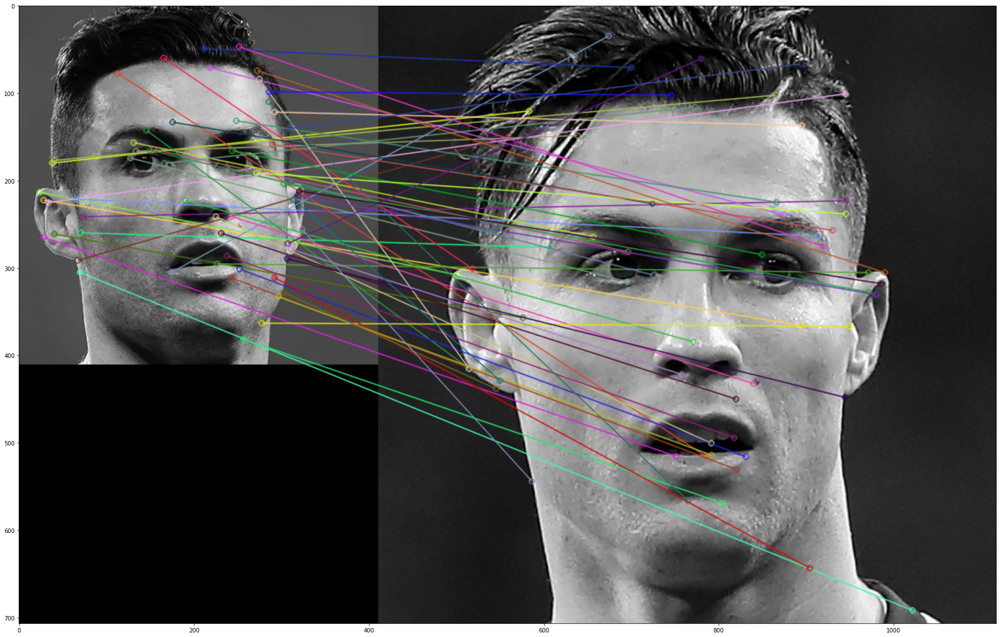

# MV_FaceDetectionWithSIFT
## Face recognition project by matching the features extracted using SIFT.

* By : Aria Radmehr
* Professor : Ali Amiri

### Dependencies
> numpy  
> opencv-contrib-python version 3.4.2.16  
> pnslib  

## Brief description of the project.
## 1- Two images are taken as input.  

Figure 1: Cristiano Ronaldo: first picture.  

Figure 2: Cristiano Ronaldo: second picture.

> Note that only images consisting of a single face are considered.

## 2- Extracting Keypoints and Descriptors using SIFT.

> Then images are passed through a face detection algorithm.For face detection, we use OpenCV's haarcascade classifier.

## 3- Matching the descriptors of the two images.

> After that the faces are detected, we crop out the region of interests from the images and pass it on to the feature extraction algorithm.